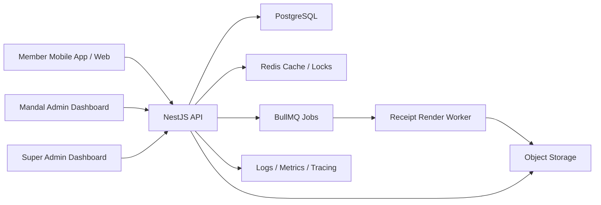

# System Design: Digital Mandal

## 1. Architecture Overview

Digital Mandal should be built as a modular monolith first using NestJS, PostgreSQL, Redis, and a background queue. This gives high development speed while keeping clear module boundaries so services can be split later if scale requires it.

Recommended stack:

- Backend: NestJS.
- API style: REST for MVP, OpenAPI documented.
- Database: PostgreSQL.
- Cache and locks: Redis.
- Queue: BullMQ with Redis.
- Object storage: S3-compatible storage.
- PDF/image rendering: background workers.
- Auth: JWT access tokens with refresh tokens.
- ORM: Prisma or TypeORM. Prisma is recommended for speed and type safety.
- Observability: OpenTelemetry, structured logs, metrics, error tracking.

## 2. High-Level Components



## 3. Multi-Tenant Model

Every business table must include `mandal_id` unless it is truly platform-level.

Tenant isolation rules:

- Super admin can access all mandals.
- Mandal admin can access only their mandal.
- Group leader can access assigned group data.
- Member can access only their own slips and assigned festival form.
- All service methods must receive tenant context from authenticated user.

Use database indexes that start with `mandal_id` for tenant-scoped queries.

## 4. Core Domain Modules

### Auth Module

- Login.
- Refresh token.
- Logout.
- Password reset.
- Role and permission guards.
- Device/session tracking.

### Mandals Module

- Mandal profile.
- Subscription/access status.
- Branding.
- Admin assignment.

### Festivals Module

- Festival setup.
- Active festival selection.
- Target collection amount.
- Festival-specific templates and fields.

### Members Module

- Member CRUD.
- Groups.
- Areas.
- Role assignment.
- Active/inactive status.

### Templates Module

- Template upload.
- Template asset storage.
- Dynamic field placement.
- Preview generation.
- Versioning.

### Vargani Module

- Collection form schema.
- Slip creation.
- Slip number generation.
- Collection record.
- Receipt render job enqueue.
- Slip history and cancellation.

### Expenses Module

- Expense categories.
- Expense entries.
- Approval workflow.
- Bill image upload.

### Reports Module

- Dashboards.
- Aggregates.
- Exports.

### Audit Module

- Event recording.
- Sensitive action trail.
- Correction history.

## 5. Data Model

### Main Tables

`users`

- id
- mandal_id nullable for super admin
- name
- phone
- email
- password_hash
- role
- status
- created_at
- updated_at

`mandals`

- id
- name
- slug
- logo_url
- address
- city
- state
- contact_name
- contact_phone
- status
- plan
- created_at
- updated_at

`festivals`

- id
- mandal_id
- name
- type
- start_date
- end_date
- target_amount
- status
- active_template_version_id
- created_at

`member_groups`

- id
- mandal_id
- festival_id
- name
- leader_user_id
- area_name

`members`

- id
- mandal_id
- user_id
- festival_id
- group_id
- display_name
- phone
- area_name
- status

`slip_templates`

- id
- mandal_id
- festival_id nullable
- name
- status
- created_by
- created_at

`slip_template_versions`

- id
- template_id
- version
- background_file_url
- canvas_width
- canvas_height
- render_config_json
- is_active
- created_at

`custom_fields`

- id
- mandal_id
- festival_id
- key
- label
- type
- required
- options_json
- print_on_slip
- dashboard_filter
- sort_order

`vargani_slips`

- id
- mandal_id
- festival_id
- slip_number
- contributor_name
- contributor_phone
- contributor_address
- shop_name
- amount
- payment_mode
- collected_by_user_id
- group_id
- area_name
- status
- custom_data_json
- receipt_pdf_url
- receipt_image_url
- idempotency_key
- created_at
- cancelled_at
- cancellation_reason

`expenses`

- id
- mandal_id
- festival_id
- category_id
- amount
- vendor_name
- expense_date
- notes
- bill_file_url
- status
- created_by
- approved_by
- created_at

`audit_events`

- id
- mandal_id
- actor_user_id
- entity_type
- entity_id
- action
- before_json
- after_json
- metadata_json
- created_at

### Critical Indexes

- `vargani_slips(mandal_id, festival_id, created_at)`
- `vargani_slips(mandal_id, festival_id, collected_by_user_id, created_at)`
- `vargani_slips(mandal_id, festival_id, group_id, created_at)`
- `vargani_slips(mandal_id, festival_id, slip_number)` unique
- `vargani_slips(idempotency_key)` unique where not null
- `expenses(mandal_id, festival_id, expense_date)`
- `users(phone)` unique where phone is not null

## 6. Slip Number Generation

Slip numbers must be unique and sequential per mandal and festival.

Recommended approach:

- Create `slip_sequences` table with `mandal_id`, `festival_id`, `current_value`.
- Use a database transaction and row-level lock.
- Increment sequence inside the same transaction that creates the slip.
- Format number after increment, for example `DM-GNP-2026-000001`.

Why:

- Prevents duplicates under high concurrent mobile submissions.
- Easier to audit than client-generated numbers.

## 7. Receipt Rendering

Slip creation and receipt rendering should be decoupled.

Flow:

1. API validates payload.
2. API creates slip with status `active` and render status `pending`.
3. API enqueues render job.
4. Worker renders PDF/image using template version and data.
5. Worker uploads files to object storage.
6. Worker updates slip with generated file URLs.

For low traffic, the API can wait briefly for rendering. For peak traffic, return immediately with slip ID and let the frontend poll or subscribe to render status.

## 8. Template System

The template engine should follow the print-id-craft style:

- Upload background image/PDF.
- Define canvas size.
- Add text fields with x/y coordinates.
- Configure font family, size, weight, color, max width, alignment.
- Bind each field to system field or custom field.
- Preview with sample data.
- Version templates. Existing slips must always render from the template version used at creation time.

Render config example:

```json
{
  "fields": [
    {
      "binding": "contributor_name",
      "x": 120,
      "y": 240,
      "fontSize": 18,
      "fontWeight": "600",
      "color": "#111111",
      "maxWidth": 360,
      "align": "left"
    },
    {
      "binding": "amount",
      "x": 580,
      "y": 240,
      "fontSize": 18,
      "format": "currency_inr"
    }
  ]
}
```

## 9. Dashboard Strategy

For MVP, dashboards can use indexed SQL queries.

At scale, add aggregate tables:

`collection_daily_aggregates`

- mandal_id
- festival_id
- date
- member_id
- group_id
- area_name
- payment_mode
- total_amount
- slip_count

Update aggregate tables from slip creation events through queue workers. This keeps dashboards fast even when raw slip volume becomes very large.

## 10. Caching

Cache:

- Active festival config.
- Member permissions.
- Template metadata.
- Dashboard summary for short TTL.

Do not cache:

- Slip creation result before persistence.
- Financial totals without a clear invalidation path.

## 11. API Design

Example endpoints:

- `POST /auth/login`
- `POST /auth/refresh`
- `POST /super-admin/mandals`
- `GET /super-admin/mandals`
- `POST /mandals/:mandalId/festivals`
- `POST /mandals/:mandalId/members`
- `POST /mandals/:mandalId/templates`
- `POST /mandals/:mandalId/templates/:templateId/versions`
- `GET /member/active-form`
- `POST /vargani/slips`
- `GET /vargani/slips/:id`
- `POST /vargani/slips/:id/cancel`
- `GET /reports/collections`
- `GET /reports/member-wise`
- `POST /expenses`
- `GET /expenses`

## 12. Production Readiness

Must-have before launch:

- Tenant isolation tests.
- Load test for slip creation.
- Duplicate slip number test.
- Queue retry and dead-letter handling.
- Database backup policy.
- Error tracking.
- Request logging with correlation IDs.
- Admin audit logs.
- Rate limiting.
- Secure file upload validation.
