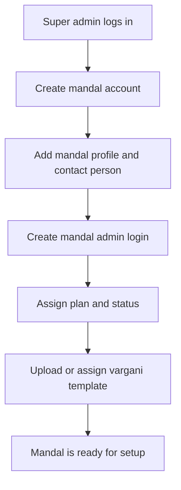
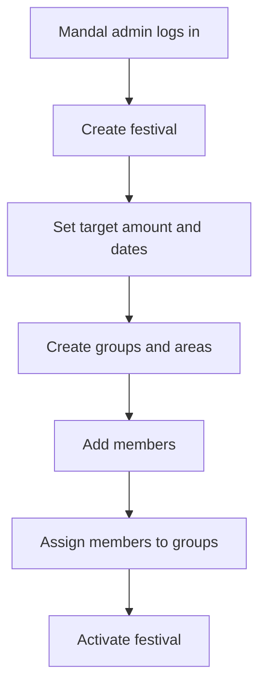
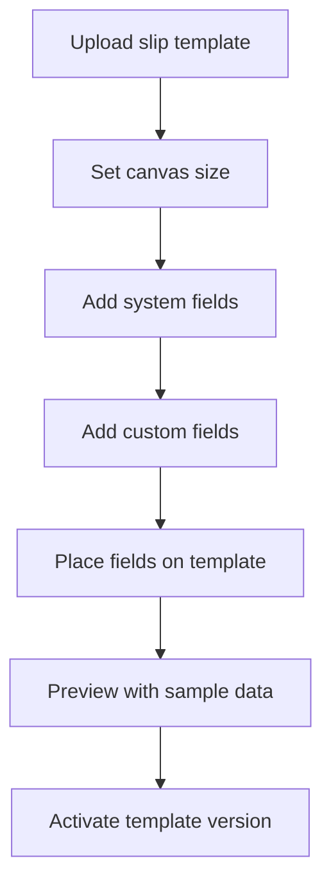
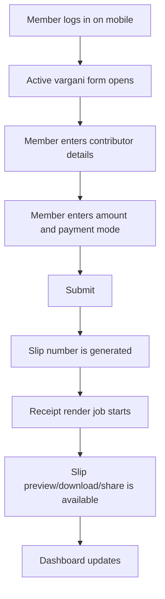
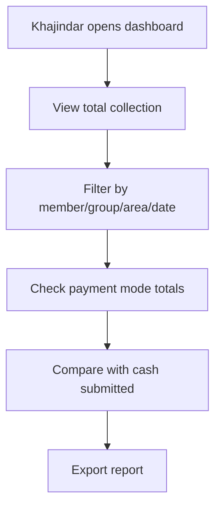
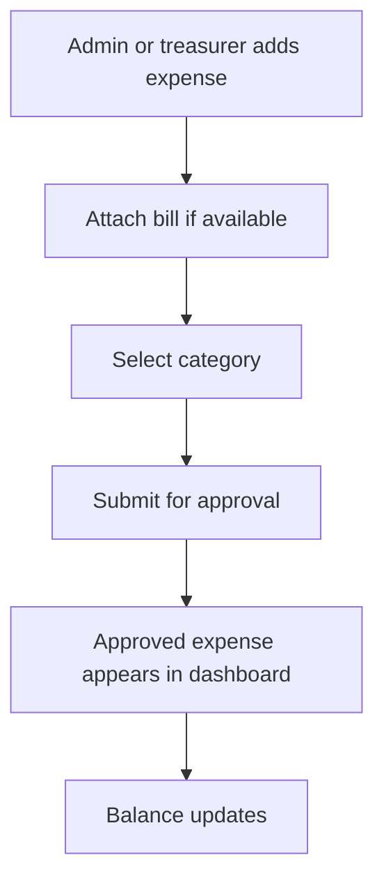
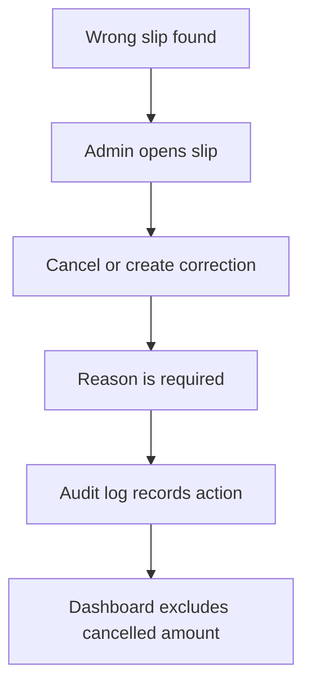
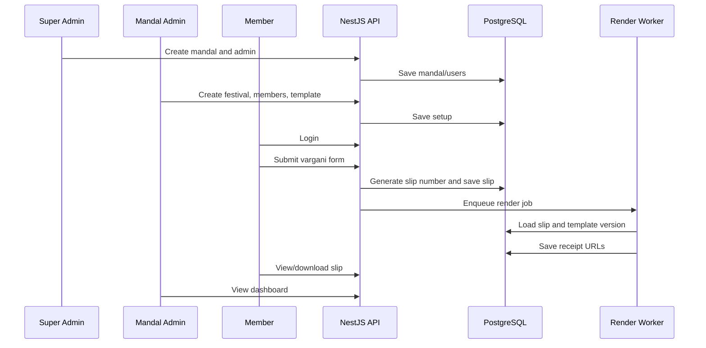

# User Flows: Digital Vargani

## 1. Super Admin Onboards A Mandal

Steps:

1. Super admin logs in.
2. Opens Mandals.
3. Clicks Create Mandal.
4. Enters mandal name, locality, city, contact person, mobile, and status.
5. Creates mandal admin credentials.
6. Optionally uploads starter vargani template.
7. Sends login details to mandal admin.

## 2. Mandal Admin Sets Up Festival

Example:

- Festival: Ganpati 2026.
- Target amount: Rs. 15,00,000.
- Groups: Market Area, Station Road, Society Area.
- Members: 50 to 300 people.
- Teams: 2 to 3 members per area.

## 3. Mandal Admin Configures Vargani Slip

System fields:

- Slip number.
- Date.
- Contributor name.
- Shop name.
- Address/area.
- Amount.
- Payment mode.
- Collected by.
- Mandal name.
- Festival name.

Custom fields examples:

- Building name.
- Room number.
- Sponsor category.
- Reference person.
- Receipt notes.

## 4. Member Collects Vargani

Field experience:

1. Member visits a shop or house.
2. Opens Digital Mandal mobile web app.
3. Logs in.
4. Form opens directly for active festival.
5. Enters contributor name, shop name, amount, payment mode, and custom fields.
6. Taps Generate Slip.
7. Slip number is created instantly.
8. Receipt is generated from mandal template.
9. Member can show, download, or share the slip.

## 5. Treasurer Tracks Collection

Dashboard answers:

- How much has the mandal collected today?
- Which member collected how much?
- Which group is leading?
- Which area is pending?
- How much cash should each member submit?
- How much came by UPI?
- What is the balance after expenses?

## 6. Expense Tracking Flow

Expense categories:

- Decoration.
- Sound.
- Lighting.
- Prasad.
- Permissions.
- Dahi Handi prize.
- Mandap.
- Miscellaneous.

## 7. Correction And Cancellation Flow

Rules:

- Members should not silently edit amount after generation.
- Admin or treasurer can cancel with reason.
- Correction creates a new record or correction event.
- Original slip remains auditable.

## 8. No-Login / Assisted Generator Option

Some mandals may want a controlled no-login generator for temporary volunteers or kiosks.

Recommended approach:

- Mandal admin creates a limited generator link.
- Link is scoped to mandal, festival, group, and optional area.
- Link has expiry date and max slip count.
- Link can be disabled instantly.
- Every slip generated from link is marked as `source = limited_link`.

This avoids giving permanent credentials to temporary helpers while still keeping accountability.

## 9. End-To-End MVP Journey

